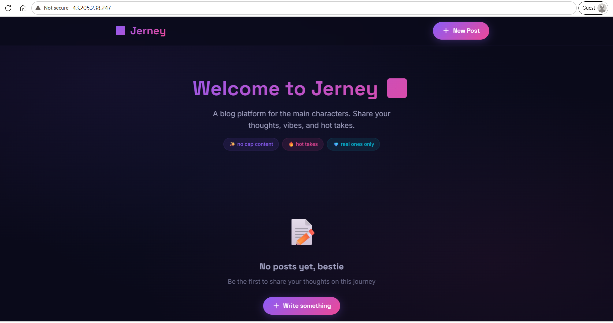
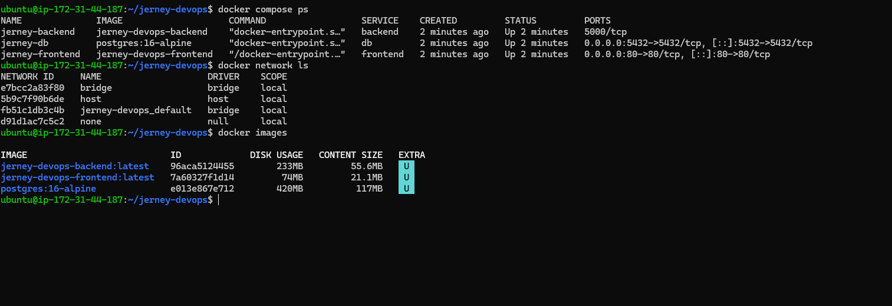
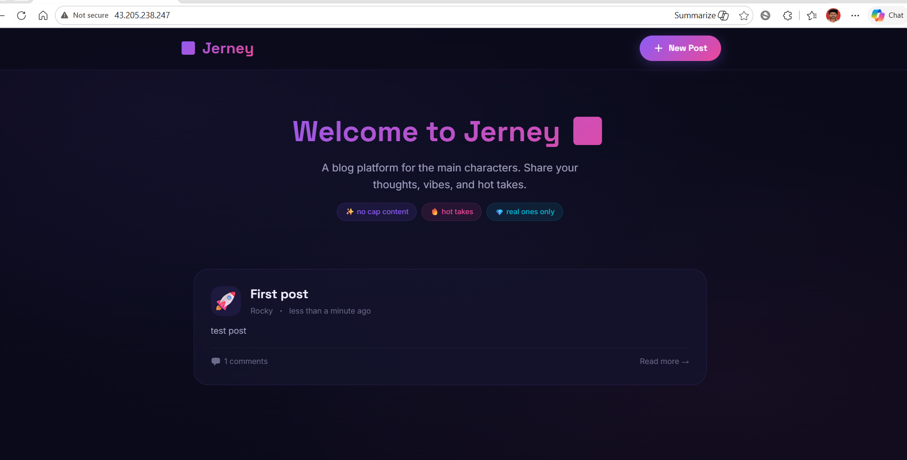
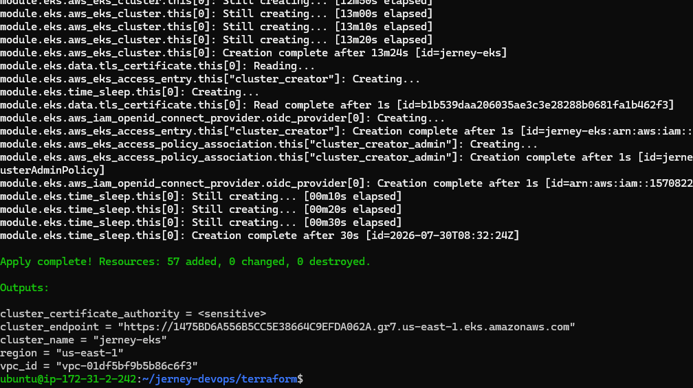
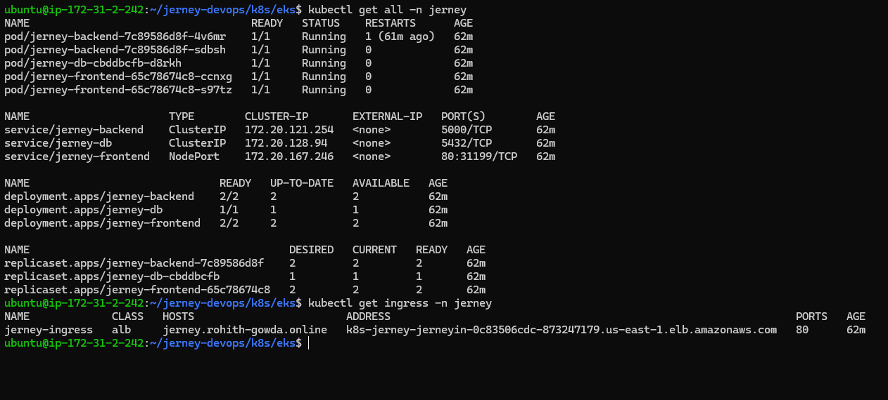
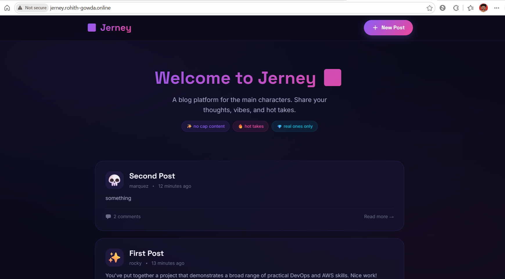
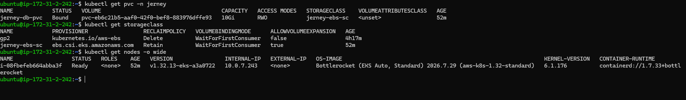

# 📘 Jerney Engineering Journal

> This journal documents the complete journey of building, containerizing, and deploying the **Jerney** blog platform from a locally hosted application to a cloud-native deployment on Amazon Web Services using Docker, Kubernetes, Terraform, Amazon EKS, and Route 53.

---

# Project Overview

## Objective

The goal of this project was to gain hands-on experience with modern DevOps practices by progressively deploying a full-stack application through multiple environments.

The deployment journey followed these stages:

```text
Local Development
        │
        ▼
AWS EC2
        │
        ▼
Docker
        │
        ▼
Docker Compose
        │
        ▼
Kubernetes (Minikube)
        │
        ▼
Terraform
        │
        ▼
Amazon EKS
        │
        ▼
AWS Load Balancer Controller
        │
        ▼
Amazon Route 53
        │
        ▼
Custom Domain
```

---

# Technology Stack

## Application

- React
- Node.js
- Express
- PostgreSQL

## DevOps

- Docker
- Docker Compose
- Kubernetes
- Helm
- Terraform

## AWS

- Amazon EC2
- Amazon VPC
- Amazon EKS
- Amazon ECR
- Amazon EBS
- AWS Load Balancer Controller
- Amazon Route 53
- IAM

---

# 1. Run Application on AWS EC2

## Architecture

```text
React Frontend
      │
      ▼
Node.js Backend
      │
      ▼
PostgreSQL
```

## Objective

Deploy the application on a Linux server without containers.

## What I Did

- Cloned the repository into an EC2 instance
- Installed Node.js
- Installed PostgreSQL
- Installed Nginx
- Installed PM2
- Created the PostgreSQL database
- Created the database user
- Configured environment variables
- Started the backend using PM2
- Configured Nginx as a reverse proxy
- Accessed the application using the EC2 public IP

---

## Problems Faced

### Backend Not Starting

#### Error

```text
SASL: SCRAM-SERVER-FIRST-MESSAGE:
client password must be a string
```

#### Root Cause

Database environment variables were missing.

#### Solution

Configured:

- DB_HOST
- DB_PORT
- DB_NAME
- DB_USER
- DB_PASSWORD

---

### Nginx Returning 500

#### Root Cause

Backend process was not running.

#### Solution

- Checked PM2 logs
- Fixed backend configuration
- Restarted PM2

---

## Outcome

✅ Successfully deployed the application on an EC2 instance.



---

# 2. Dockerize Backend

## Objective

Containerize the Express backend.

## Dockerfile

```dockerfile
FROM node:20-alpine

WORKDIR /app

COPY package*.json ./

RUN npm install

COPY . .

EXPOSE 5000

CMD ["node", "src/index.js"]
```

---

## Problems Faced

### Docker Permission Denied

#### Error

```text
permission denied while trying to connect to docker.sock
```

#### Solution

```bash
sudo usermod -aG docker ubuntu
```

Reconnect to the SSH session.

---

### npm ci Failed

#### Error

```text
npm ci requires package-lock.json
```

#### Root Cause

The project did not contain a package-lock.json file.

#### Solution

```bash
npm install
```

This generated the required lock file.

---

## Outcome

Successfully built the backend image.

```bash
docker build -t jerney-backend .
```

---

# 3. Dockerize Frontend

## Objective

Containerize the React frontend.

## Dockerfile

A multi-stage Docker build was used.

```text
Build Stage
      │
npm run build
      │
      ▼
Nginx Stage
      │
Serve Static Files
```

---

## Problems Faced

### Container Exited Immediately

#### Error

```text
host not found in upstream "jerney-backend"
```

#### Root Cause

The backend container was unavailable because Docker networking had not yet been configured.

#### Solution

Deploy both containers using Docker Compose.

---

## Outcome

Successfully built the frontend image.

```bash
docker build -t jerney-frontend .
```

---

# 4. Docker Compose

## Architecture

```text
Frontend Container
        │
        ▼
Backend Container
        │
        ▼
PostgreSQL Container
```

---

## Objective

Run the complete application using multiple Docker containers.

---

## What I Did

Created:

```text
docker-compose.yml
```

Configured:

- Frontend service
- Backend service
- PostgreSQL service
- Persistent volume
- Docker network
- Environment variables

---

## Problems Faced

### Port 5432 Already in Use

#### Error

```text
failed to bind host port 5432
```

#### Root Cause

PostgreSQL was already running on the EC2 host.

#### Solution

```bash
sudo systemctl stop postgresql
```

---

### Port 80 Already in Use

#### Error

```text
failed to bind host port 80
```

#### Root Cause

Nginx was already running on the EC2 host.

#### Solution

```bash
sudo systemctl stop nginx
```

---

### Backend Restarting Continuously

#### Error

```text
ECONNREFUSED 127.0.0.1:5432
```

#### Investigation

```bash
docker inspect jerney-backend
```

Found:

```text
DB_HOST missing
```

#### Root Cause

Forgot to configure the database hostname inside docker-compose.yml.

#### Solution

```yaml
DB_HOST: db
```

Recreated the containers.

---

## Biggest Learning

Containers communicate using the Docker service name.

Incorrect:

```text
DB_HOST=localhost
```

Correct:

```text
DB_HOST=db
```

---

## Outcome

Successfully started:

- PostgreSQL
- Backend
- Frontend

The application became accessible using the EC2 public IP.



---

# 5. Verify Data Persistence

## Objective

Verify that PostgreSQL data persists even after containers are recreated.

---

## Test Performed

Created a blog post.

```text
First Post
```

Stopped the application:

```bash
docker compose down
```

Started it again:

```bash
docker compose up -d
```

---

## Result

The blog post was still present after recreating the containers.

---

## Learning

```text
Container Removed
       │
       ▼
Volume Remains
       │
       ▼
Database Remains
       │
       ▼
Data Persists
```

---

## Outcome

Docker volumes successfully provided persistent storage.



---

# 6. Provision AWS Infrastructure using Terraform

## Objective

Provision the complete AWS infrastructure using Infrastructure as Code.

---

## Resources Created

Terraform was used to provision:

- Amazon VPC
- Public Subnets
- Private Subnets
- Internet Gateway
- NAT Gateway
- Route Tables
- Security Groups
- Amazon EKS Cluster
- Managed Node Group

---

## Commands Used

```bash
terraform init

terraform plan

terraform apply
```

---

## Learning

Using Terraform allows cloud infrastructure to be:

- Version controlled
- Reproducible
- Automated
- Easily destroyed when no longer required

---

## Outcome

AWS infrastructure successfully provisioned.



---

# 7. Deploy Application to Amazon EKS

## Objective

Deploy the application to a managed Kubernetes cluster.

---

## What I Did

Created Kubernetes manifests for:

- Namespace
- Secrets
- StorageClass
- Persistent Volume Claim
- PostgreSQL Deployment
- Backend Deployment
- Frontend Deployment
- ClusterIP Services
- Network Policy

Applied the manifests using:

```bash
kubectl apply -f .
```

---

## Verification

Verified deployment using:

```bash
kubectl get pods -n jerney

kubectl get svc -n jerney

kubectl get pvc -n jerney

kubectl get nodes
```

---

## Outcome

All application components were successfully deployed and reached the **Running** state.



---

# 8. Configure AWS Load Balancer Controller

## Objective

Expose the Kubernetes application to the internet using an AWS Application Load Balancer.

---

## What I Did

- Associated IAM OIDC Provider with the EKS cluster
- Created IAM Policy
- Created IAM Service Account (IRSA)
- Installed AWS Load Balancer Controller using Helm
- Created Kubernetes Ingress

---

## Problems Faced

### Load Balancer Not Being Created

#### Root Cause

The IAM Role trusted the OIDC provider from a previous EKS cluster.

As a result, the AWS Load Balancer Controller could not assume the IAM role.

---

### Solution

- Deleted the existing IAM Service Account
- Recreated the IAM Service Account using `eksctl`
- Reinstalled the AWS Load Balancer Controller

After recreating the service account, the Application Load Balancer was successfully provisioned.

---

## Learning

The IAM trust policy must match the OIDC provider associated with the current EKS cluster.

Recreating the cluster changes the OIDC provider, so existing IAM roles may no longer work.

---

## Outcome

Application successfully exposed using an AWS Application Load Balancer.


---

# 9. Configure Custom Domain

## Objective

Access the application using a custom domain.

---

## What I Did

- Purchased a domain from GoDaddy
- Created a Route 53 Hosted Zone
- Created an Alias A Record pointing to the ALB
- Updated GoDaddy nameservers
- Waited for DNS propagation

---

## Problems Faced

### Domain Not Resolving

#### Root Cause

GoDaddy was still using its default nameservers.

---

### Solution

Updated the domain nameservers to the Route 53 nameservers.

After DNS propagation completed, the domain resolved correctly.

---

## Outcome

Application successfully accessible at:

```text
http://rohith-gowda.online
```



---

# 10. Persistent Storage in Kubernetes

## Objective

Persist PostgreSQL data using Amazon EBS.

---

## What I Did

Created:

- StorageClass
- Persistent Volume Claim

Mounted the persistent volume to PostgreSQL.

---

## Verification

```bash
kubectl get storageclass

kubectl get pvc

kubectl get nodes
```

---

## Outcome

Persistent storage successfully attached to PostgreSQL.



---

# Challenges Faced Throughout the Project

| Challenge | Resolution |
|------------|------------|
| PostgreSQL authentication failed | Configured the required database environment variables |
| Docker permission denied | Added the user to the Docker group |
| Missing package-lock.json | Generated the lock file using `npm install` |
| Frontend could not communicate with backend | Used Docker Compose networking |
| Backend could not connect to PostgreSQL | Changed `DB_HOST` from `localhost` to the Docker service name |
| Port 5432 already in use | Stopped the PostgreSQL service running on the EC2 host |
| Port 80 already in use | Stopped the Nginx service running on the EC2 host |
| Load Balancer was not created | Recreated the IAM Service Account with the correct OIDC provider |
| Ingress remained in Pending state | Verified AWS Load Balancer Controller installation and IAM permissions |
| ALB Target Group unhealthy | Verified service ports, container ports, and readiness of application pods |
| Custom domain not resolving | Updated GoDaddy nameservers to Route 53 nameservers and waited for DNS propagation |
| Pods unable to start | Investigated pod logs using `kubectl logs` and fixed configuration issues |
| Kubernetes resources not created | Verified namespace and reapplied manifests |

---

# Commands Learned

## Docker

```bash
docker build

docker images

docker ps

docker ps -a

docker logs

docker exec -it

docker inspect

docker network ls

docker volume ls

docker compose up -d

docker compose down

docker compose logs
```

---

## Kubernetes

```bash
kubectl apply -f

kubectl get pods

kubectl get svc

kubectl get ingress

kubectl get pvc

kubectl get storageclass

kubectl get nodes

kubectl describe pod

kubectl logs

kubectl delete

kubectl rollout restart deployment
```

---

## Terraform

```bash
terraform init

terraform fmt

terraform validate

terraform plan

terraform apply

terraform destroy
```

---

## Helm

```bash
helm repo add

helm repo update

helm install

helm list

helm uninstall
```

---

## AWS CLI

```bash
aws configure

aws eks update-kubeconfig

aws ecr get-login-password
```

---

# Final Architecture

```text
                    Internet
                        │
                        ▼
              rohith-gowda.online
                        │
                        ▼
                 Amazon Route 53
                        │
                        ▼
         AWS Application Load Balancer
                        │
                        ▼
             Kubernetes Ingress (ALB)
                        │
        ┌───────────────┴───────────────┐
        ▼                               ▼
 React Frontend Pods           Express Backend Pods
                                        │
                                        ▼
                               PostgreSQL Pod
                                        │
                                        ▼
                      Amazon EBS Persistent Volume
```

---

# Key Learnings

Throughout this project I learned how a modern cloud-native application is built and deployed using DevOps tools and AWS services.

Some of the most valuable lessons include:

- Building and containerizing applications with Docker
- Managing multi-container applications using Docker Compose
- Understanding Docker networking and service discovery
- Persisting application data using Docker volumes
- Writing Infrastructure as Code using Terraform
- Deploying applications to Kubernetes
- Managing workloads using Deployments, Services, Ingress, and Persistent Volumes
- Provisioning and managing an Amazon EKS cluster
- Configuring IAM Roles for Service Accounts (IRSA)
- Installing and configuring the AWS Load Balancer Controller
- Exposing Kubernetes applications through an Application Load Balancer
- Configuring DNS using Amazon Route 53
- Troubleshooting Kubernetes workloads using logs, events, and resource descriptions
- Understanding the relationship between networking, IAM, storage, and Kubernetes resources in AWS

---

# Final Outcome

Successfully designed, containerized, and deployed a full-stack blogging application using modern DevOps practices.

## Technologies Used

### Frontend

- React

### Backend

- Node.js
- Express

### Database

- PostgreSQL

### Containerization

- Docker
- Docker Compose

### Container Orchestration

- Kubernetes
- Helm

### Infrastructure as Code

- Terraform

### Cloud Platform

- Amazon Web Services (AWS)

### AWS Services

- Amazon EC2
- Amazon ECR
- Amazon EKS
- Amazon VPC
- Amazon EBS
- IAM
- AWS Load Balancer Controller
- Amazon Route 53

---

The application was successfully deployed and validated on AWS using a custom domain:

```text
http://rohith-gowda.online
```

After successful validation, the cloud infrastructure was intentionally destroyed using Terraform to avoid unnecessary AWS costs.

This project provided practical experience in deploying, managing, and troubleshooting cloud-native applications using industry-standard DevOps tools and workflows.