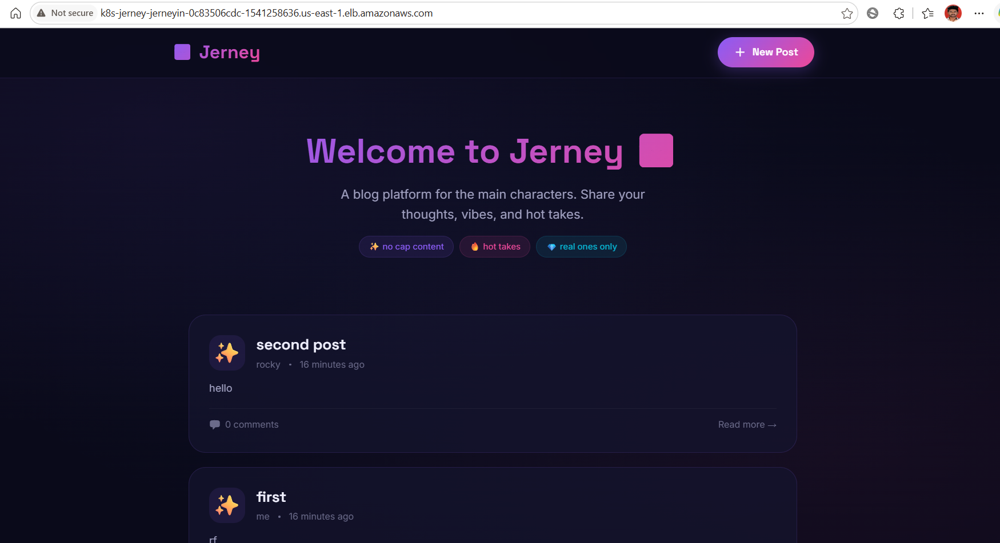

# 📘 Jerney Engineering Journal

This journal documents the engineering journey of deploying the **Jerney** blogging platform from a traditional server deployment to a cloud-native application running on Amazon EKS.

Rather than explaining the project architecture (covered in the README), this document focuses on the implementation process, challenges encountered, and lessons learned throughout the deployment.

---

# Deployment Journey

```text
Local Deployment
      │
      ▼
AWS EC2
      │
      ▼
Docker
      │
      ▼
Docker Compose
      │
      ▼
Kubernetes (Minikube)
      │
      ▼
Terraform
      │
      ▼
Amazon EKS
      │
      ▼
AWS Load Balancer Controller
      │
      ▼
Amazon Route 53
      │
      ▼
jerney.rohith-gowda.online
```

---

# 1. Deploy Application on AWS EC2

## Objective

Deploy the application on a Linux server without containerization to understand the complete application stack and its runtime dependencies.

## Implementation

- Cloned the repository onto an EC2 instance
- Installed Node.js
- Installed PostgreSQL
- Installed Nginx
- Installed PM2
- Created the application database
- Configured environment variables
- Started the backend using PM2
- Configured Nginx as a reverse proxy

---

## Challenges

### PostgreSQL Authentication Failed

**Error**

```text
SASL: SCRAM-SERVER-FIRST-MESSAGE:
client password must be a string
```

**Cause**

Database environment variables were not configured.

**Solution**

Configured:

- DB_HOST
- DB_PORT
- DB_NAME
- DB_USER
- DB_PASSWORD

---

### Nginx Returned HTTP 500

**Cause**

Backend process failed to start.

**Solution**

- Checked PM2 logs
- Corrected backend configuration
- Restarted the PM2 process

---

## Result

The application was successfully deployed on EC2 and accessible through the instance's public IP.


---

# 2. Containerize the Backend

## Objective

Package the Express backend into a Docker image.

## Implementation

Created a Dockerfile based on the official Node.js Alpine image and built the backend image.

```bash
docker build -t jerney-backend .
```

---

## Challenges

### Docker Permission Denied

**Error**

```text
permission denied while trying to connect to docker.sock
```

**Solution**

```bash
sudo usermod -aG docker ubuntu
```

Reconnected to the SSH session.

---

### npm ci Failed

**Cause**

The project did not include a `package-lock.json` file.

**Solution**

```bash
npm install
```

Generated the required lock file before rebuilding the image.

---

## Result

Successfully built the backend container image.

---

# 3. Containerize the Frontend

## Objective

Package the React application into a Docker image.

## Implementation

Implemented a multi-stage Docker build:

- Build stage using Node.js
- Runtime stage using Nginx

---

## Challenges

### Frontend Container Exited Immediately

**Error**

```text
host not found in upstream "jerney-backend"
```

**Cause**

The frontend attempted to connect to a backend container that did not yet exist on a shared Docker network.

**Solution**

Moved both services into Docker Compose.

---

## Result

Successfully built the frontend image.

```bash
docker build -t jerney-frontend .
```

---

# 4. Docker Compose

## Objective

Run the frontend, backend, and PostgreSQL containers as a single application.

## Implementation

Configured Docker Compose to manage:

- Frontend
- Backend
- PostgreSQL
- Shared Docker network
- Persistent volume
- Environment variables

---

## Challenges

### Port 5432 Already in Use

**Cause**

PostgreSQL was already running on the EC2 host.

**Solution**

```bash
sudo systemctl stop postgresql
```

---

### Port 80 Already in Use

**Cause**

Nginx was already running.

**Solution**

```bash
sudo systemctl stop nginx
```

---

### Backend Could Not Connect to PostgreSQL

**Error**

```text
ECONNREFUSED 127.0.0.1:5432
```

**Investigation**

```bash
docker inspect jerney-backend
```

The container did not receive the database hostname.

**Cause**

`DB_HOST` was missing from `docker-compose.yml`.

**Solution**

```yaml
DB_HOST: db
```

Recreated the containers.

---

## Key Learning

Containers communicate using service names instead of localhost.

Incorrect:

```text
DB_HOST=localhost
```

Correct:

```text
DB_HOST=db
```

---

## Result

Successfully started:

- PostgreSQL
- Backend
- Frontend

The application became accessible through the EC2 public IP.


---

# 5. Verify Persistent Storage

## Objective

Confirm that PostgreSQL data remains available after containers are recreated.

## Test

Created a sample blog post and restarted the application.

```bash
docker compose down

docker compose up -d
```

## Result

The data remained intact after restarting the containers, confirming that Docker volumes persisted the PostgreSQL database.

---

# 6. Provision AWS Infrastructure with Terraform

## Objective

Provision the networking infrastructure and Amazon EKS cluster using Infrastructure as Code.

## Implementation

Terraform was used to provision:

- VPC
- Public and Private Subnets
- Internet Gateway
- NAT Gateway
- Route Tables
- Security Groups
- Amazon EKS Cluster
- Managed Node Group

Deployment commands:

```bash
terraform init

terraform plan

terraform apply
```

## Key Learning

Using Terraform made the infrastructure reproducible, version-controlled, and easy to recreate or destroy when required.

## Result

Successfully provisioned the networking infrastructure and Amazon EKS cluster.


---
# 7. Deploy the Application to Amazon EKS

## Objective

Deploy the containerized application to a managed Kubernetes cluster on AWS.

## Implementation

Applied Kubernetes manifests for:

- Namespace
- Secrets
- StorageClass
- PersistentVolumeClaim
- PostgreSQL Deployment
- Backend Deployment
- Frontend Deployment
- ClusterIP Services
- Ingress

```bash
kubectl apply -f .
```

---

## Verification

Verified that all workloads were running correctly.

```bash
kubectl get pods -n jerney

kubectl get svc -n jerney

kubectl get ingress -n jerney

kubectl get pvc -n jerney
```

All Pods entered the **Running** state and Kubernetes successfully created the application resources.


---

# 8. Configure the AWS Load Balancer Controller

## Objective

Expose the Kubernetes application through an AWS Application Load Balancer.

## Implementation

Completed the following configuration:

- Associated the IAM OIDC Provider
- Created the IAM Policy
- Created an IAM Role for Service Accounts (IRSA)
- Installed the AWS Load Balancer Controller using Helm
- Applied the Kubernetes Ingress resource

---

## Challenge

### Application Load Balancer Not Created

The Ingress resource remained in a pending state and no Application Load Balancer was provisioned.

### Cause

The IAM Role trusted an OIDC provider from a previous EKS cluster. Because the cluster had been recreated, the OIDC provider changed and the Load Balancer Controller could no longer assume the IAM role.

### Solution

- Deleted the existing IAM Service Account
- Recreated the IAM Service Account using `eksctl`
- Reinstalled the AWS Load Balancer Controller

After reinstalling the controller, the Application Load Balancer was successfully provisioned.

---

## Result

Successfully exposed the application through an AWS Application Load Balancer.



---

# 9. Configure the Custom Domain

## Objective

Access the application using a custom domain instead of the generated ALB DNS name.

## Implementation

Configured:

- Amazon Route 53 Hosted Zone
- Alias A Record pointing to the Application Load Balancer
- GoDaddy nameservers

---

## Challenge

### Domain Not Resolving

Initially, the custom domain did not resolve.

### Cause

GoDaddy continued using its default nameservers instead of the Route 53 Hosted Zone.

### Solution

Updated the domain nameservers in GoDaddy and waited for DNS propagation.

---

## Result

The application became accessible at:

```text
http://jerney.rohith-gowda.online
```


---

# 10. Configure Persistent Storage

## Objective

Persist PostgreSQL data within Kubernetes.

## Implementation

Configured:

- StorageClass
- PersistentVolumeClaim

Mounted the persistent volume to the PostgreSQL Deployment.

---

## Verification

```bash
kubectl get storageclass

kubectl get pvc

kubectl get nodes
```

The PersistentVolumeClaim was successfully bound and attached to PostgreSQL.


---

# Major Challenges

| Challenge | Resolution |
|------------|------------|
| PostgreSQL authentication failed | Configured the required database environment variables |
| Docker socket permission denied | Added the user to the Docker group |
| Docker networking issues | Used Docker Compose service names instead of `localhost` |
| Port conflicts on EC2 | Stopped host PostgreSQL and Nginx services |
| ALB not provisioning | Recreated the IAM Service Account with the correct OIDC provider |
| Custom domain not resolving | Updated GoDaddy nameservers to Route 53 |

---

# Key Learnings

This project provided practical experience with the complete lifecycle of deploying a cloud-native application.

Key takeaways include:

- Containerizing applications using Docker
- Managing multi-container applications with Docker Compose
- Writing Infrastructure as Code using Terraform
- Deploying workloads to Kubernetes
- Provisioning and managing an Amazon EKS cluster
- Configuring IAM Roles for Service Accounts (IRSA)
- Installing the AWS Load Balancer Controller
- Exposing Kubernetes applications using Ingress and an Application Load Balancer
- Configuring DNS with Amazon Route 53
- Troubleshooting Kubernetes, networking, IAM, and cloud infrastructure

---

# Final Outcome

The Jerney blogging platform was successfully deployed from a traditional EC2-based setup to a fully containerized cloud-native architecture running on Amazon EKS.

The final deployment included:

- Docker
- Docker Compose
- Kubernetes
- Amazon EKS
- Terraform
- Amazon ECR
- AWS Load Balancer Controller
- Amazon Route 53
- Amazon EBS Persistent Storage

The application was successfully validated using:

```text
http://jerney.rohith-gowda.online
```

After validation, the AWS infrastructure was intentionally destroyed using Terraform to avoid unnecessary cloud costs.

---

# Conclusion

This project significantly improved my understanding of modern DevOps practices by providing hands-on experience with containerization, Kubernetes, Infrastructure as Code, and AWS cloud services. Beyond deploying the application, the troubleshooting process—resolving Docker networking issues, Kubernetes configuration problems, IAM permissions, Load Balancer provisioning, and DNS propagation—provided valuable insight into operating cloud-native applications in production-like environments.
